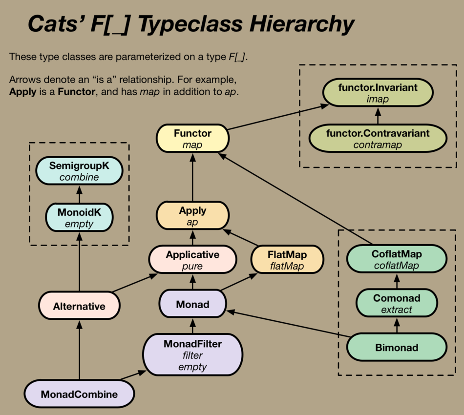

# Monad Transformers

Under the guidance of Peter Perháč, we will look into monad transformers (MT); what they are, why and how to use them. Since Monad type class is not part of the Scala standard library, we will be leaning on abstractions and using data types from the Typelevel Cats library. The aim of this session is to get everyone acquainted with the idea of monad transformers (and with Cats).

We will explore different ways they can be used to make your code neater and help with everyday tasks. Look at using MTs in for-comprehensions and covering a couple of lifting techniques to achieve this. We'll also explore using MTs outside of for-comprehensions, getting familiar with methods like `subflatMap`, `semiflatMap`, etc.

Understanding monads and type classes is not a prerequisite for this session (though having a rough idea what they are will help).

## What's in this repository

 - `package.scala`
   - various plumbing
 - `repositories.scala`
   - a bunch of "repositories" with hard-coded data in the form of `Map`s
   - the repositories provide a variety of return types to play with: i.e. `OptionT[F, T]`, `Future[Option[T]]`, `Future[T]` (and `Future[Unit]`)
 - `models.scala`
   - a bunch of `case class`es for demonstration
 - `Main` object
   - scratch-sheet-like app for convenience. Main is the default app that runs on `sbt run`
 - **`HelloFutureOptions`**
   - demonstrates working with our repositories *without* cats and monad transformers.
   - the `OptionT` returned from one of the repository methods is *re-nested* via the `value` property of `OptionT`
   - this app shows how we *could* write apps if we're hell-bent on avoiding the convenience of libraries such as **cats**
 - **`HelloOptionT`**
   - demonstrates working with `OptionT` monad transformer. Lifting is done via utility methods on `OptionT` companion object: `apply`, `fromOption`, `some`, `liftF`
   - below the line are example usages of other methods available on `OptionT`, such as `flatMapF`, `semiflatMap`, `subflatMap`
 - **`HelloOptionT2`**
   - same as above, but lifting is done via an `implicit class` that introduces the *thrush operator*
   - below the line are example usages of other methods available on `OptionT`, such as `flatMapF`, `semiflatMap`, `subflatMap`
 - **`HelloSemiflatMap`**
   - working with monad transformers outside of a for-comprehension. Linking a bunch of `flatMap`, `semiflatMap`, `subflatMap`, `flatMapF`
   - an example usage of `flatTap` (nothing to do with monad transformers, just wanted to show it)
   - pros - certain operations can be achieved without resorting to for-comprehensions, cons - most useful applications can't make use of this approach
 - **`HelloEitherT`**
   - Better error reporting with `EitherT` monad transformer. Slightly more complex type signatures, more explicit typing, more verbose lifting
   - below the line are examples of converting between `OptionT` and `EitherT`
 - **Tests**
   - testing the behaviour of the apps, making sure `HelloFutureOptions`, `HelloOptionT`, `HelloOptionT2`, behave the same
   - demonstrate better error reporting achieved by using `EitherT`

-----

## Monads don't compose

Monad `F` knows how to flatten `F[F[A]]` into a `F[A]`.
Monad `G` knows how to flatten `G[G[A]]` into a `G[A]`.

Having a monad `F` and monad `G`, can we compose them?

No, not generically. Monads don't compose.

By composing monad `F` and monad `G` we won't magically get a monad that knows how to flatten `F[G[F[G[A]]]]` into an `F[G[A]]` because there's always an `F` or a `G` in the way. Monad `F` can't know what `G` will be (and vice-versa), so monads can't be composed _generically_.

However, in some special cases, certain monads _can_ be composed in a specific way. This is where monad transformers come into play. We can't have MTs for all monads, but for some it's possible: e.g. `OptionT`, `EitherT`, `ReaderT`, `WriterT`.

Not all monads have a respective monad transformer.

In some cases, though it is possible to write specialised monads (yes, a monad transformer is in itself a monad) that offer the effects of both the base monad and the wrapping monad.

For example, the `OptionT[F[_], A]` monad transformer must implement all the functionality of the Option monad, _and_ delegate to the underlying base monad (`F`).

------

